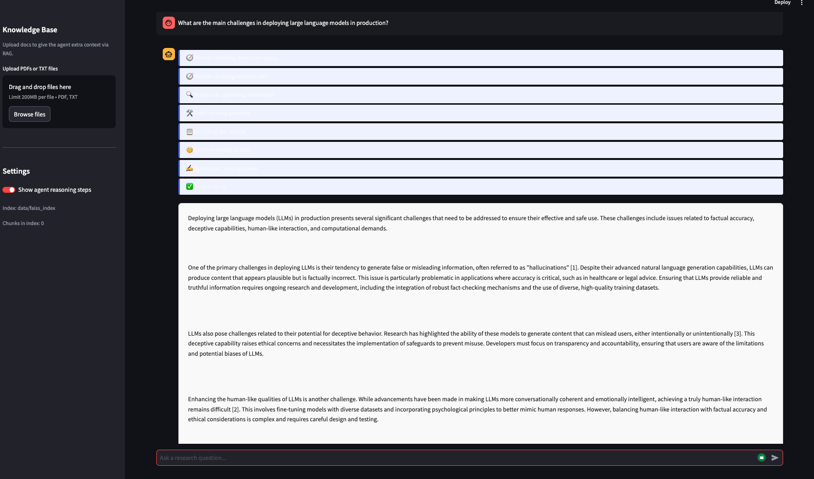
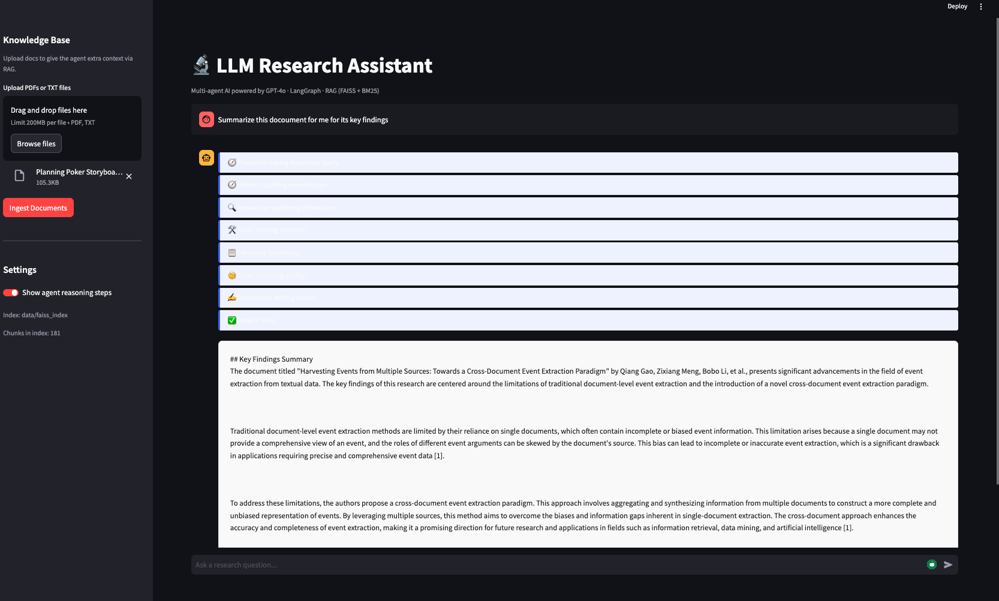
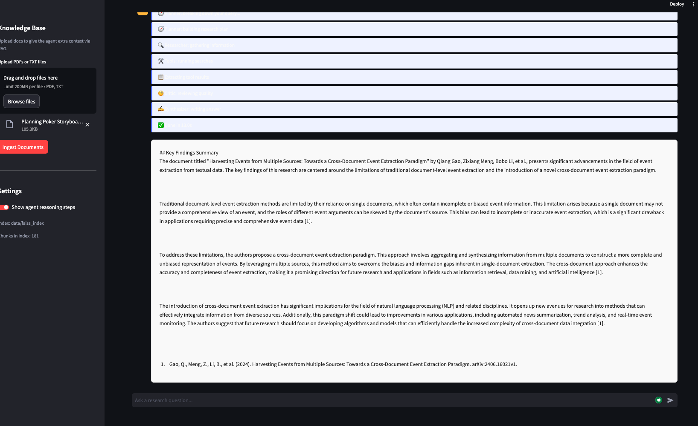

# LLM Research Assistant

A multi-agent research pipeline that takes a question and returns a cited, structured answer by autonomously searching your documents, arXiv, and Wikipedia.

Built this because I kept doing the same manual loop — search arXiv, skim papers, check Wikipedia for background, paste it all into a doc. Wanted to see how far LLM agents could automate that loop, including catching their own bad answers.

---

## Demo







---

## How it works

Four agents run in sequence using LangGraph:

**Planner** breaks your query into 3-5 sub-questions so the researcher stays focused.

**Researcher** calls tools in a loop — hits your local document index first (FAISS + BM25), then arXiv for recent papers, then Wikipedia for background.

**Critic** reads all the research notes and decides if the answer is solid or has gaps. If it finds problems it sends the researcher back. Getting this loop right was the trickiest part — early versions would approve everything even when the notes were empty.

**Synthesizer** writes the final answer with numbered citations.

```
query → planner → researcher → tools
                      ↓
                   extract tool results
                      ↓
                   critic → (loop back if gaps found)
                      ↓
                 synthesizer → final answer
```

The RAG side uses hybrid retrieval — FAISS for semantic similarity and BM25 for keyword matching, merged with Reciprocal Rank Fusion. This catches things pure semantic search misses, especially exact terms and proper nouns.

---

## Setup

```bash
git clone https://github.com/dhairyaa442/llm-research-assistant.git
cd llm-research-assistant

python -m venv venv
source venv/bin/activate  # Windows: venv\Scripts\activate

pip install -r requirements.txt

cp .env.example .env
# add your OPENAI_API_KEY to .env
```

**Run the UI:**
```bash
streamlit run app.py
```

**Run the API:**
```bash
uvicorn api:app --reload --port 8000
```

**Docker:**
```bash
docker-compose up --build
```

---

## Ingesting your own documents

Drop PDFs or text files into a folder and run:

```bash
python scripts/ingest_docs.py ./my_papers/
```

Or upload directly in the Streamlit sidebar. The FAISS index saves to disk so you don't re-embed on every restart.

---

## API

`POST /research`
```json
{ "query": "How does RLHF compare to DPO for LLM alignment?" }
```

Returns:
```json
{
  "answer": "...",
  "sub_questions": ["What is RLHF?", "What is DPO?", "..."],
  "iterations": 2,
  "elapsed_seconds": 18.4
}
```

`POST /ingest` — add documents programmatically
`GET /health` — check index size and status

---

## Project structure

```
src/
  agents/graph.py          — LangGraph state graph, all 4 agents + extract node
  rag/pipeline.py          — FAISS + BM25 + RRF hybrid retrieval
  tools/research_tools.py  — arXiv, Wikipedia, RAG, citation tools
  utils/helpers.py         — logging, formatting helpers
  config.py                — env-based settings

scripts/
  ingest_docs.py           — bulk ingest PDFs/TXT from a folder
  run_research.py          — CLI for running queries without the UI

tests/
  test_rag_and_tools.py    — unit tests for RAG logic and tools

app.py                     — Streamlit frontend
api.py                     — FastAPI backend
```

---

## Config

| Variable | Default | What it does |
|---|---|---|
| `OPENAI_API_KEY` | — | Required |
| `MODEL_NAME` | `gpt-4o` | Swap to `gpt-4o-mini` to cut costs |
| `MAX_ITERATIONS` | `10` | How many times critic can send researcher back |
| `CHUNK_SIZE` | `512` | Token chunk size when splitting docs |
| `CHUNK_OVERLAP` | `64` | Overlap between chunks |
| `FAISS_INDEX_PATH` | `./data/faiss_index` | Where the index is saved |

---

## Tests

```bash
pytest tests/ -v
```

---

## Known limitations

- Wikipedia tool hits disambiguation errors on niche topics — it tries the first suggestion but sometimes gets the wrong page
- FAISS index isn't safe for concurrent writes, don't ingest and query simultaneously in production
- The critic occasionally approves thin research on very obscure topics where all three tools return limited results
- No streaming token output from the API yet — the full answer comes back at once
- Cold start is slow on first query while the embedding model initializes

---

## License

MIT